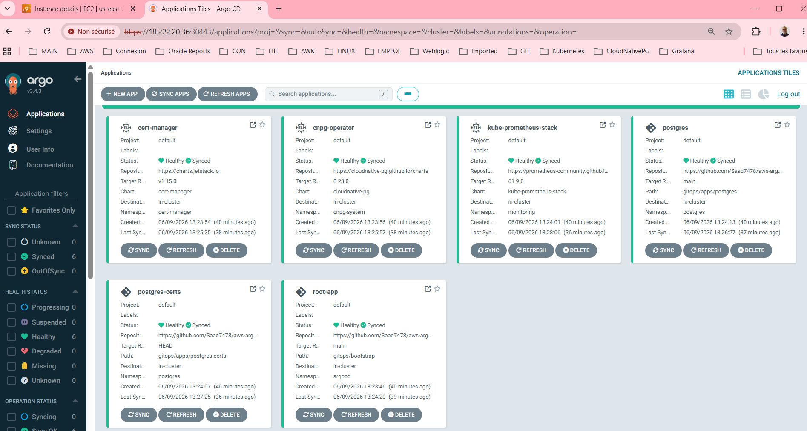
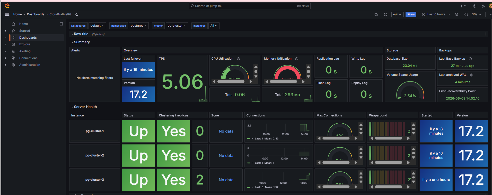
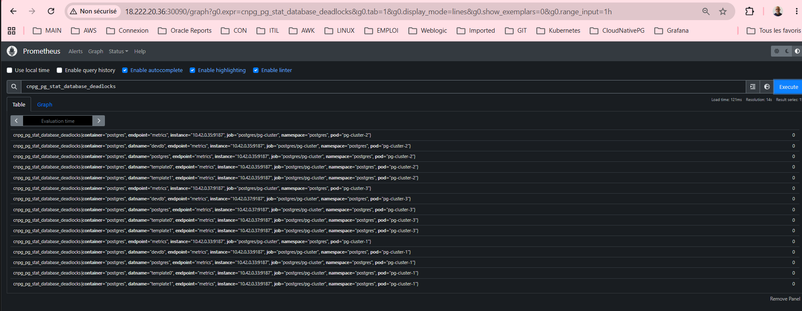
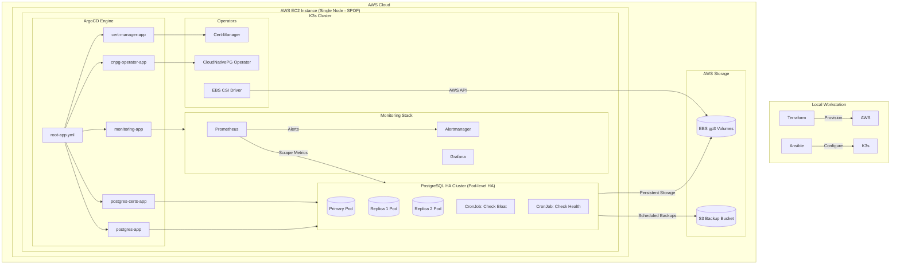
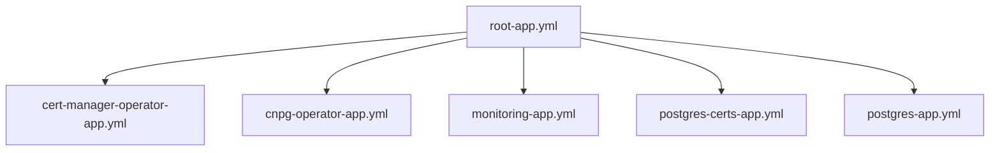
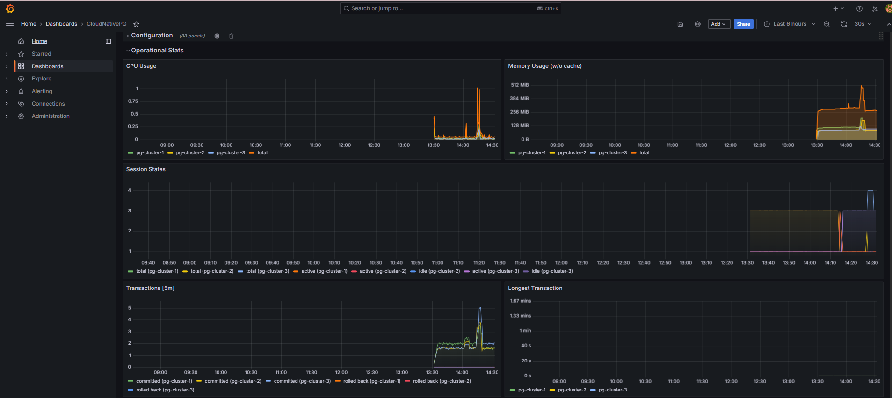

# AWS GitOps Lab


## Platform Overview

### ArgoCD GitOps Dashboard



### PostgreSQL Monitoring via Grafana



### Metrics Collection




### High-Availability PostgreSQL with CloudNativePG, K3s and ArgoCD

### An End-to-End IaC & GitOps Laboratory on AWS K3s via ArgoCD

A production-ready, Infrastructure as Code (IaC) and GitOps laboratory implementing a highly available PostgreSQL cluster on AWS. This project demonstrates automated provisioning, continuous deployment, and self-healing database infrastructure.

## 1. Key Features

* **Infrastructure as Code (IaC):** Modular Terraform deployment of AWS VPC, Security Groups, EBS storage, and EC2 instances.
* **Automated Provisioning:** Ansible playbooks for OS hardening, swap configuration, and K3s cluster deployment.
* **GitOps Reconciliation:** ArgoCD implementation utilizing the **App-of-Apps** pattern for true declarative state enforcement.
* **Cloud-Native Database Management:** High-Availability PostgreSQL (1 Primary, 2 Replicas) managed by the **CloudNativePG (CNPG)** Operator.
* **Storage Excellence:** Dynamic volume provisioning leveraging AWS `gp3` via the EBS CSI Driver.
* **Enterprise Observability:** Full monitoring stack featuring Prometheus, Grafana (with custom CNPG dashboards), custom CronJobs for table/index bloat detection, and Alertmanager rules for PostgreSQL deadlocks.
* **Disaster Recovery & PITR:** Automated continuous WAL archiving and scheduled physical backups pushed directly to AWS S3, enabling robust Point-in-Time Recovery (PITR).

## 2. Architecture Overview

Current Architecture Status: PoC & Simulated HA (v0.1.0)
This laboratory currently serves as a Proof of Concept (PoC) designed to validate the GitOps workflow pipeline, ArgoCD synchronization patterns, and the lifecycle mechanisms of the CloudNativePG operator.

### Compute & Physical Layout
Single-Node Topology: To optimize resource utilization and cloud spend during this validation phase, the entire K3s cluster is hosted on a single AWS EC2 instance.

### Storage Allocation: 
Persistent volumes are provisioned dynamically via the AWS EBS CSI driver, mapping Kubernetes PVs to underlying AWS EBS (gp3) volumes attached to this single instance.

### Database High Availability vs. Infrastructure SPOF
Application-Level HA: The CloudNativePG operator is natively configured for high availability, maintaining a 3-node PostgreSQL topology (1 Primary, 2 Replicas). Streaming replication, automated failover, and self-healing are fully operational and managed by the operator at the Pod level.

### Infrastructure Limitation: 
Because all Kubernetes worker nodes and database Pods reside on the same physical EC2 instance, the underlying compute layer represents a Single Point of Failure (SPOF). A failure of the EC2 instance or the host Availability Zone (AZ) will result in a service outage, despite the internal HA configuration of the database.

### ⚠️ Production Roadmap Note: 
This single-node footprint is intentional for development cost control. Moving to production will involve migrating the IaC layers (Terraform/Ansible) to a multi-AZ K3s cluster or an AWS EKS topology across at least 3 distinct Availability Zones, leveraging Pod Anti-Affinity rules to distribute the PostgreSQL replicas across separate physical hosts.

## 3. Components & Bootstrap Hierarchy

The infrastructure follows a strict dependency lifecycle managed natively by ArgoCD (`root-app.yml`):

1.  **Cert-Manager Operator**: Manages internal and database TLS certificates.
2.  **CloudNativePG Operator**: Manages the PostgreSQL cluster lifecycle, failover, and switchover.
3.  **Monitoring Stack**: Prometheus Operator, Grafana dashboards, and custom Alertmanager routing.
4.  **PostgreSQL Infrastructure**: High-availability database cluster, custom StorageClasses, metrics services, and backup automation.



## 4. Bootstrap Dependency Hierarchy

The infrastructure follows a strict deployment lifecycle orchestrated by ArgoCD through the root-app.yml application.


## 5. Deployment Sequence

To prevent race conditions and initialization failures within Kubernetes, resources are applied in a strict topological order. Below is the step-by-step operational justification for each layer of the pipeline:

[01. Cert-Manager] ──► [02. CNPG Operator] ──► [03. Monitoring] ──► [04. DB Certs] ──► [05. Postgres Cluster]

## 6. Project Structure
```text
.
├── README.md
├── ansible
│   ├── ansible.cfg
│   ├── inventories
│   │   └── dev
│   ├── playbooks
│   │   ├── group_vars
│   │   │   └── all.yaml
│   │   ├── install-argocd.yml
│   │   ├── install-k3s.yml
│   │   └── site.yml
│   └── roles
│       ├── argocd
│       │   ├── tasks
│       │   │   ├── argocd.yml
│       │   │   ├── deployment.yml
│       │   │   ├── ebs_csi.yml
│       │   │   ├── main.yml
│       │   │   └── monitoring.yml
│       │   └── templates
│       │       └── smtp-secrets.yml.j2
│       └── k3s
│           └── tasks
│               ├── create_swap.yml
│               ├── k3s.yml
│               ├── main.yml
│               └── prereqs.yml
├── et --hard HEAD~1
├── gitops
│   ├── apps
│   │   ├── postgres
│   │   │   ├── Chart.yaml
│   │   │   ├── files
│   │   │   │   ├── cloudnativepg.json
│   │   │   │   └── custom-metrics.yaml
│   │   │   ├── scripts
│   │   │   │   ├── check_bloat.py
│   │   │   │   └── check_health.py
│   │   │   ├── templates
│   │   │   │   ├── cronjob-pg-monitor.yaml
│   │   │   │   ├── custom-metrics-configmap.yaml
│   │   │   │   ├── grafana-dashboard-cnpg.yaml
│   │   │   │   ├── metrics-service.yml
│   │   │   │   ├── postgres-cluster.yaml
│   │   │   │   ├── postgres-restore.yaml
│   │   │   │   ├── prometheusrule-deadlocks.yaml
│   │   │   │   ├── scheduled-backup.yaml
│   │   │   │   └── storageclass-gp3.yaml
│   │   │   └── values.yaml
│   │   └── postgres-certs
│   │       ├── certs-infra.yaml
│   │       └── certs-postgres.yaml
│   └── bootstrap
│       ├── cert-manager-operator-app.yml
│       ├── cnpg-operator-app.yml
│       ├── monitoring-app.yml
│       ├── postgres-app.yml
│       ├── postgres-certs-app.yml
│       └── root-app.yml
├── images
│   ├── argocd1.png
│   ├── grafana1.png
│   ├── grafana2.png
│   └── prometheus1.png
├── terraform
│   ├── environments
│   │   └── dev
│   │       ├── inventory.tf
│   │       ├── main.tf
│   │       ├── outputs.tf
│   │       ├── providers.tf
│   │       ├── templates
│   │       │   ├── hosts.tpl
│   │       │   └── ssh_config.tpl
│   │       ├── terraform.tfvars
│   │       └── variables.tf
│   └── modules
│       ├── compute
│       │   ├── main.tf
│       │   ├── outputs.tf
│       │   └── variables.tf
│       ├── security
│       │   ├── main.tf
│       │   ├── outputs.tf
│       │   └── variables.tf
│       ├── storage
│       │   ├── main.tf
│       │   ├── outputs.tf
│       │   └── variables.tf
│       └── vpc
│           ├── main.tf
│           ├── outputs.tf
│           └── variables.tf
└── terraform.tfstate
```

## 7. Day-2 Database Operations

A true production-grade platform is defined by how it behaves after deployment. This laboratory goes beyond initial PostgreSQL bootstrapping by implementing, automating, and validating critical Day-2 operational workflows.

### High Availability & Automated Failover
Health Probes & Liveness: The CloudNativePG operator continuously monitors database pod health via customized readiness and liveness probes hooked directly into PostgreSQL's internal state.

Automated Failover (RTO < 30s): If the primary instance suffers a hardware or software failure, the operator automatically detects the loss, selects the most up-to-date replica based on Write-Ahead Log (WAL) positions, and promotes it to Primary.

Traffic Rerouting: Kubernetes Services are dynamically updated by the operator to instantly reroute write traffic to the new Primary and read-heavy traffic to the remaining Replicas, minimizing application downtime.

### Backup, Restore & Point-in-Time Recovery (PITR)
Continuous WAL Archiving: Every completed WAL segment is encrypted and instantly shipped to a secure AWS S3 bucket, achieving a near-zero Recovery Point Objective (RPO).

Scheduled Physical Backups: Full, consistent physical snapshots are executed daily via automated Kubernetes ScheduledBackup resources, offloading the process to replica nodes to eliminate performance impact on the Primary.

PITR Validation: The architecture natively supports creating a cloned instance at a specific timestamp by replaying a full physical backup combined with subsequent WAL streams from S3.

### Zero-Downtime Maintenance & Patching
Rolling Updates: When upgrading the PostgreSQL minor version or modifying underlying OS configurations, the operator orchestrates a controlled, rolling update.

Controlled Switchover: Before a primary pod is restarted for maintenance, the operator performs a clean switchover—promoting a replica to primary first—to ensure zero data loss and a sub-second disruption to application connections.

### Performance Tuning & Deep Observability
Advanced Metrics Collection: Utilizing the Prometheus Operator to scrape native PostgreSQL statistics (pg_stat_database, pg_stat_user_tables, pg_stat_replication).

DBA-Centric Dashboards: Custom Grafana dashboards track transaction throughput (TPS), replication lag (in bytes and time), cache hit ratios, and connection pool utilization.

Database Maintenance Automation: Native integration of automated maintenance routines, including scheduled table/index bloat detection alerts and proactive lock/deadlock monitoring via Alertmanager.

## 8. Observability & Alerting

### Prometheus Alerting Rules
The platform implements granular, production-ready alerting thresholds via the Prometheus Operator to ensure proactive incident management.

**PostgreSQL Deadlocks:**
Immediate alerting on deadlock detection to pinpoint application-level transaction conflicts.

**Replication Lag:**
Monitors bytes and time lag between the Primary and Replicas to protect against data loss in the event of a failover.

**Cluster Degradation:**
Alerts when any PostgreSQL pod transitions out of a Ready state or when the replication quorum is compromised.

**Storage Consumption:**
Predictively alerts when underlying persistent volumes (gp3) hit 80% capacity to avoid disk-full transaction blocks.

**Manifest Reference:**
prometheusrule-deadlocks.yaml

### Grafana Dashboards
Deep runtime visibility into the PostgreSQL engine is provided by customized dashboards tailored specifically for the CloudNativePG operator ecosystem, tracking:

**Throughput & Performance:**
Active connections, transaction throughput (TPS), and Cache Hit Ratios.

**Replication Dynamics:**
Real-time stream tracking, replica sync status, and WAL generation rates.

**Resource Saturation:** 
CPU, memory memory-mapping (shared_buffers), and IOPS consumption per database pod.

**Configuration Reference:**
cloudnativepg.json

### Automated Maintenance
To keep the database running optimally without manual DBA intervention, native Kubernetes CronJobs execute specialized scripts during off-peak hours:

**Table & Index Bloat Analysis (check_bloat.py):**
Scans database statistics to detect table and index bloat caused by PostgreSQL's MVCC model, generating reports to guide proactive VACUUM and reindexing schedules.

**Transactional Health Validation (check_health.py):**
Executes read/write synthetic transactions against the Primary endpoint to validate end-to-end driver compatibility and cluster responsiveness.

### Security & Storage Engineering

**Encryption & Network Isolation**
Mutual TLS (mTLS): All intra-cluster communications (Primary-to-Replica data streaming) and external client-to-database connections are strictly encrypted via TLSv1.3.

**Automated Certificate Lifecycle:**
Cert-Manager manages the automated minting, deployment, and rotation of internal cluster cryptographic identities.

**Network Segregation:**
AWS Security Groups and Kubernetes NetworkPolicies restrict traffic, ensuring only authorized application workloads within the cluster can access the database port (5432).

**Manifest References:**
certs-infra.yaml, certs-postgres.yaml

### Storage Performance Architecture

Database workloads demand reliable, high-throughput, low-latency storage. The platform provisions dedicated block devices leveraging an optimized AWS Elastic Block Store (EBS) profile:

**Dynamic Provisioning:**
Fully integrated with the AWS EBS CSI Driver to map Kubernetes Persistent Volume Claims (PVCs) automatically.

**Tuned gp3 StorageClass:**
Configured with custom parameters to guarantee baseline IOPS and throughput, specifically optimized for PostgreSQL sequential write access (WAL logging) and random read operations.

**Manifest Reference:**
storageclass-gp3.yaml

## 9. Deployment Guide

**Prerequisites**
- AWS CLI configured
- Terraform >= 1.5
- Ansible >= 2.15
- kubectl
- ArgoCD CLI
- Helm

### Step 1 – Provision AWS Infrastructure
cd terraform/environments/dev

terraform init
terraform plan
terraform apply -auto-approve

This step provisions:

VPC
VPC Endpoint
Subnets
Security Groups
IAM Role
Instance PRofile
EC2 Instances
EBS Volumes

It also generates the Ansible inventory automatically.

### Step 2 – Bootstrap K3s with Ansible

cd ../../../ansible

**cat ansible.cfg**

```text
[defaults]
inventory = inventories/dev/hosts.ini
host_key_checking = False
private_key_file = ~/.ssh/aws-kube-postgres
remote_user = rocky
roles_path = roles
log_path = ~/aws-kube-postgres/ansible/ansible.log
interpreter_python = /usr/bin/python3.9
vault_password_file = ~/.ansible_vault_pass
```

**Start the SSH agent in the background and load the private key for authentication**
eval "$(ssh-agent -s)"                      
ssh-add ~/.ssh/aws-kube-postgres

**Execute playbook**
ansible-playbook playbooks/site.yml

This playbook:

Installs OS prerequisites
Deploys K3s
Installs the EBS CSI Driver
Deploys ArgoCD
Apply the root application:
```bash
    kubectl apply -f gitops/bootstrap/root-app.yml
```
ArgoCD automatically deploys:
    Cert-Manager
    CloudNativePG
    Monitoring Stack
    PostgreSQL HA Cluster
    postgres-certs

## 10. Validation & Troubleshooting

### Connect to EC2 instance

```bash
ssh kube
sudo su -
```

### ArgoCD

**Get ArgoCd Password**

```bash
kubectl -n argocd get secret argocd-initial-admin-secret -o jsonpath="{.data.password}" | base64 -d --decode; echo
```

Check ArgoCD Application Status

```bash
kubectl get applications -n argocd
```

or 

Connect to Argocd Console (wait 5 min at least) using admin/password

Argocd Console ScreenShot :


Monitor CloudNativePG Cluster State

```bash
kubectl get cluster -n postgres -w
```

Check HA Architecture Status

```bash
kubectl cnpg status pg-cluster -n postgres
```

Trigger a manual switchover test

```bash
kubectl cnpg promote pg-cluster pg-cluster-2 -n postgres
```

Display postgres pods

```bash
kubectl get pods -n postgres
```

Connect to postgres database
```bash
kubectl exec -it pg-cluster-2 -n postgres -- psql -U postgres
```
```sql
postgres=# select pg_is_in_recovery();
 pg_is_in_recovery
-------------------
 t
(1 row)
```

```bash
kubectl exec -it pg-cluster-3 -n postgres -- psql -U postgres
```

```sql
postgres=# select pg_is_in_recovery();
 pg_is_in_recovery
-------------------
 f
(1 row)
```

### Grafana
1. Get Grafana password

kubectl get secret kube-prometheus-stack-grafana -n monitoring -o jsonpath="{.data.admin-password}" | base64 --decode; echo

2. Connect to console (admin/password)

http://public-ip:30080/login

Example

http://public-ip:30080/login




### Prometheus


## 11. Technologies Used

```text
| Layer             |          Technologies                 |
|-------------------|---------------------------------------|
| **Cloud & IaC**   | AWS EC2, AWS EBS, AWS S3, Terraform   |
| **Automation**    | Ansible                               |
| **Kubernetes**    | K3s, ArgoCD, Cert-Manager             |
| **Database**      | PostgreSQL, CloudNativePG             |
| **Observability** | Prometheus, Grafana, Alertmanager     |
```

## 12. Author
**SAAD BRAHMIA**

**Senior Database Administrator | Database SRE Specialist**

A seasoned Database Administrator with over 15 years of experience architecting, securing, and maintaining highly available production database environments. Actively bridging the gap between traditional database excellence and modern Cloud-Native paradigms, specializing in Infrastructure as Code (IaC), GitOps pipelines, and automated database orchestration under Kubernetes.

**Certifications:**
Oracle Certified Professional (OCP), Oracle Certified Expert (OCE), Oracle Cloud Infrastructure (OCI), ITIL.

**Core Expertise:**
High Availability (HA/DR), CloudNativePG, PostgreSQL, Patroni, Oracle RAC, Dataguard, SQL Server AlwaysOn, Terraform, Ansible, and ArgoCD.